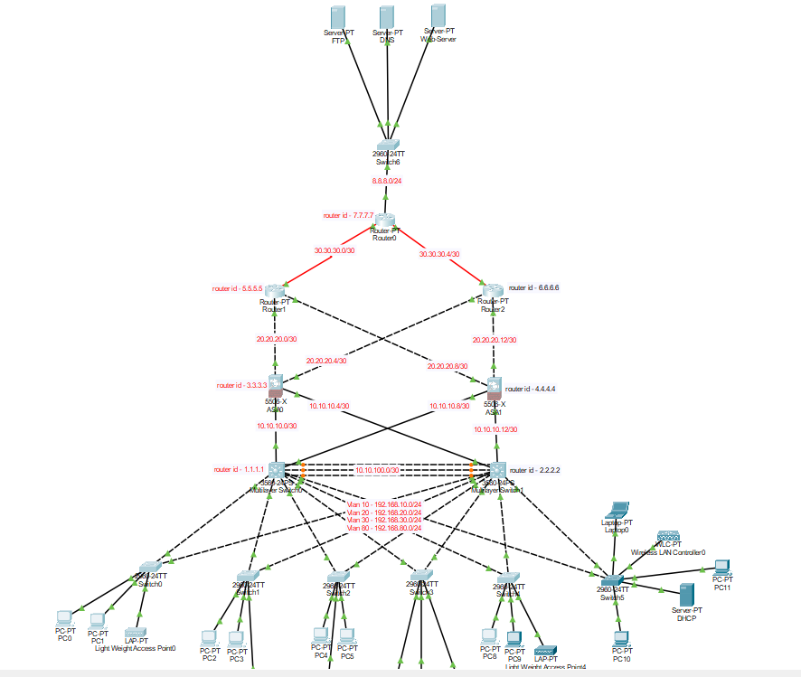

# On-Site Network Configuration with Firewall ACL Policy

## Project Overview

This project demonstrates an advanced, enterprise-grade internal networking system designed to maximize security, reliability, and scalability for organizational environments. Leveraging multiple protocols and layered security mechanisms, the architecture provides robust protection and seamless connectivity for all users and services.

## Key Features

- **Dual Router OSPF Configuration:** Implements OSPF (Open Shortest Path First) on two core routers for dynamic routing, redundancy, and rapid failover in the event of link or device failures.
- **Dual Firewall Protection:** Two layers of firewalls enforce a defense-in-depth strategy, protecting sensitive resources from both external threats and lateral movement within the network.
- **Access Control Lists (ACLs):** Granular ACLs are used to strictly regulate access to servers, segment user groups, and enforce network policies.
- **Port Security:** Switches utilize port security to prevent unauthorized devices from connecting, reducing risks from MAC spoofing or rogue endpoints.
- **VLAN Segmentation:** Multiple VLANs isolate departmental or functional traffic, improving both network security and performance.
- **Spanning Tree Protocol (STP):** STP is implemented to prevent Layer 2 network loops, ensuring a resilient and stable switching topology.
- **Hot Standby Router Protocol (HSRP):** HSRP provides gateway redundancy, ensuring uninterrupted network access if a primary router fails.
- **EtherChannel:** EtherChannel bundles multiple physical links to increase bandwidth and provide additional redundancy between switches and routers.
- **High Availability & Scalability:** The design supports organizational growth and delivers high uptime through redundant links and distributed core routing.

## Network Diagram

Below is the visual representation of the network topology. This diagram illustrates the dual-router and dual-firewall setup, VLAN segmentation, protocol implementations, server placements, and the overall logical flow of data within the organization.

## Use Cases

- **Enterprise Offices:** Perfect for organizations that require secure internal communication, departmental isolation, and high network availability.
- **Educational Institutions:** Adaptable for universities or schools to separate administration, faculty, and student networks with strict access controls.
- **Research Labs:** Ideal for environments where sensitive data and resources require layered security and strict access policies.

## Technologies & Protocols Used

- Cisco Packet Tracer (for network simulation and design)
- OSPF Routing Protocol
- Cisco Routers and Switches (simulated)
- ACL Policies
- VLANs and Port Security Features
- Spanning Tree Protocol (STP)
- Hot Standby Router Protocol (HSRP)
- EtherChannel Link Aggregation
